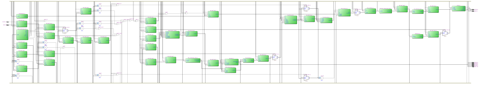
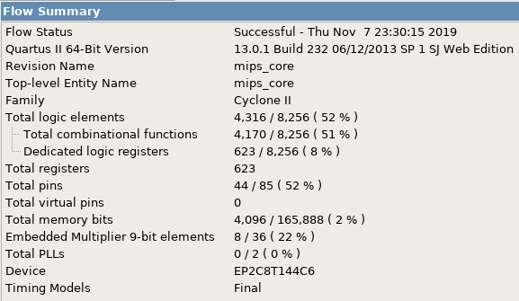

=============================================
Лабораторна робота №8
=============================================

Тема
------

Конвеєризація власного RISC ядра

Хід роботи
-------

**Завдання** 
	Конвеєризувати своє ядро, відладити його і навчитися боротися з хазардами.

**Створення проекту** 
		Проект створено на мові Verilog,це дозволило зменшити затрати в часі на створення проекту. Кожен блок було створенно окремо, що дозволило пришвидшити 
	відладку плати. Також було написано тестовий файл на мові Verilog, що допомогло відладити пристрій.

**Опис виконаної роботи** 
	Було конвеєризовано саморобне RISC подібне ядро. Конвеєр проходить 5 стадій. Фікс data hazards  відбувається пересиланням данних з інших стадій через байпас
	і заповенням конвеєра бульбашками. Відладжено ядро за допомогою симулятора Incisive. Вихідний код скомпільовано у Квартусі і визначено максимальну частоту (8.04МГц)
	В порівнянні з однотактним MIPS процесором створеним на 5-й лабораторній роботі. Конвеєризація допомогла підвищити частоту десь на 1МГц. Тож конвеєризація підвищила швидкодію
	процессора. 
	Мною було конвеєризовано моє саморобне RISC подібне ядро. Конвеєр має 5 стадій. Для боротьби з data hazards я використовую пересилання данних з інших
стадій через байпас і заповнення конвеєра бульбашками. Відладив ядро за допомогою симулятора Incisive. Потім я скомпілював вихідний код мого ядра у Квартусі
і визначив максимальну частоту, вона виявилася 8.04МГц, проти 6.75МГЦ(якщо не помиляюсь). Тож конвеєризація допомогла підвищити швидкодію процессора. Для тестів
я використовував код, який був написаний на 5-6 лабораторній роботі, а потім для закріплення результатів також код з 7 лабораторної роботи, все працює як треба.

RTL схема GPIO модуля

Використані ресурси

.. image:: media/f_max.png
Максимальна частота

Висновки
-------

	В результаті виконання лабораторної роботи було створено конвеєрний MIPS. Вивчено види конфліктів, та методи боротьби з ними. 
Під час написання вихідного коду ядра, використано принцип модульності, що підвищило читабельність коду та спростило відладку. Створений конвеєрний MIPS
дав приріст до швидкодії.
